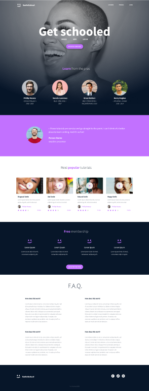

HTML ADVANCED:SMILE 

AUTHOR: Branice Kazira
Github@BraniceKaziraOtiende

This webpage is meant for practice for adavnced HTML and CSS using a premade design.

WEBSITE TEMPLATE.

Follow these steps to clone the repository and view the webpage using index.html.

Clone Repository
https://github.com/BraniceKaziraOtiende/alu-web-development.git

1.Open Webpage
2.Navigate to the cloned directory.
3.Locate the index.html file.
4.Open index.html in your preferred web browser.
Feel free to explore the webpage designed using pure HTML semantic elements.

Contact
Feel free to reach out to me for any questions or feedback.

Email:b.otiende1@alustudent.com

